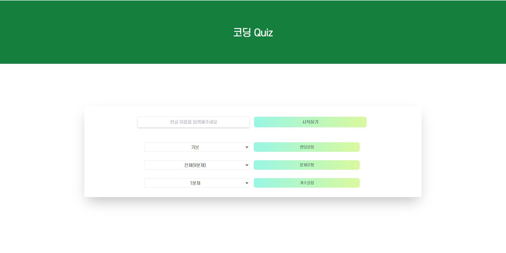

# 프로젝트 이름

   
  Quiz

  
   

## 프로젝트 소개

프로젝트 개요
 
퀴즈 앱으로써 코딩과 관련된 문제 제공

 

## STACK

Vue
 
TailwindCSs
 
Vue-router
 
Typescript
 
yarn

 

## 구현 기능

### 기능 1
사용자 설정에 맞추어 문제 개수, 카테고리 기능 제공
### 기능 2
문제 당 5초의 카운트를 제공
### 기능 3
정답과 사용자가 선택한 답을 비교하여 점수 제공
### 기능 4
힌트 기능을 구현, 힌트를 클릭했을 때 모달창으로 힌트를 제공
 

 

